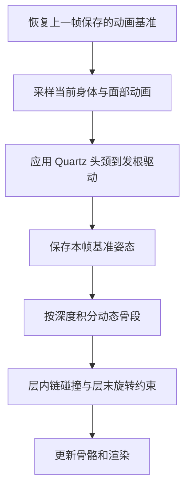

本文研究《学园偶像大师》中花海咲季（HSKI）的头发与服装二级运动：从资产与程序逆向，到解算器制作，再到画面与性能验证。头发主体以 v37 为记录基线，整合逆向笔记、制作笔记、版本差异和性能分析；随后对照已导出的布料资料与代码，补充裙摆驱动、碰撞、闭环约束及多服装验证；最后结合公开开发者资料，讨论其他游戏的实时模拟与动画制作方案。

**v8、v16、v37 是本研究复现工程的版本号，不是《学园偶像大师》官方版本号。** 三版分别回答“怎样让头发动起来”“怎样让指定接触动作更稳定”“怎样尽量还原游戏原本的计算”。

### v8：建立二级运动的初期方案

v8 使用自定义端点弹簧与阻尼，以约 120 Hz 子步更新头发骨段，再配合三个身体碰撞代理、骨长与旋转限制、前发蒙皮采样修正。它解决了导入模型只有主动画、缺少头发动态的问题。当前保留的是初期源码快照，因此本文不会把其中所有常数都视作最终 v8d 的发行实现。

### v16：针对展示动作的接触修正方案

v16 在动态骨基础上加入贴胸、脸部、下巴、袖子和手部处理。它会调整部分网格，也会通过双骨 IK 改变手臂姿态，以改善指定手势下的遮挡与接触。代价是更多 CPU 蒙皮、几何查询、数组与网格更新，以及动作标定工作。现存同名播放器后来经过重建，不能直接当作原始 v16 跑分。

### v37：以原始计算与实测输入为依据的复现方案

v37 按原始指令核对积分、碰撞、旋转、预热和 float32 运算顺序，并接入游戏采集的碰撞列表。当前有 75 段模拟、19 个身体/面部代理、7 个活动链层与 9 份 Quartz 驱动；17/19 项代理身份已确认。它移除了 v16 的额外接触制作层，以便检查原生计算结果。已有 3548 组原指令对照和 48 条手部实际采样复算，但还没有完成原游戏同姿态、同调度的端到端轨迹验证。

| 版本 | 主要目标 | 主要方法 | 评价重点 |
|---|---|---|---|
| v8 | 建立可用的二级运动 | 自定义弹簧、子步、简化碰撞与表面修正 | 稳定性与基本观感 |
| v16 | 做好指定动作的接触表现 | 动态骨叠加网格修正、手部 IK、袖子烘焙 | 接触质量、姿态变化与制作成本 |
| v37 | 尽量恢复游戏原算法 | 原指令对照、原资产参数、实测注册顺序 | 数值一致性、输入完整度与性能边界 |

## 阅读目录

1. [逆向：从资产到原始指令与运行输入](#reverse-engineering)
2. [制作：如何构造并验证解算器](#solver-development)
3. [对比：v8、v16、v37 的方法差异](#version-comparison)
4. [性能：实测区间与源码成本分析](#performance)
5. [布料研究：裙根驱动、动态骨链与服装验证](#cloth-research)
6. [游戏案例：实时二级运动与艺术控制](#game-cases)
7. [混合方案：预制关键帧、引导姿态与实时物理](#hybrid-animation)
8. [公开资料与引用范围](#references)

<!-- more -->


<h2 id="reverse-engineering">一、逆向：从资产到原始指令与运行输入</h2>

**记录基线：v37，2026-09-15。对象：花海咲季 HSKI、0070 头发、校服身体与基础面部。**

这次逆向逐渐确认了三件不同的事：资产中存了什么、原始指令怎样计算、运行时把什么数据按什么顺序交给这些指令。三者都吻合，才有资格讨论完整复现。目前计算核已有独立数值对照，运行时静态碰撞列表已接入 17/19 项可确认映射，完整同姿态逐帧轨迹仍待验证。

### 1.1 从资产开始，先确定研究对象

最初的 FBX 与动画能显示角色，却没有带回 ActorAnimation 的完整执行代码。身体动画导入也不等于头发二级运动已经恢复。于是先从原始 AssetBundle 核对组件，而不是直接找一个通用动态骨插件套参数。

| 来源 | 本次相关数据 | 用途 |
|---|---|---|
| `mdl_chr_hski-cstm-0070_hair` | 103 个动态骨组件、9 个 Quartz 头发驱动、2 个 Chain 组件 | 发梢动态、发根联动、横向链约束 |
| `mdl_chr_hski-base-0000_face` | 1 个静态碰撞体 | 头面部碰撞 |
| `mdl_chr_hski-schl-0000_body` | 18 个静态碰撞体；另有服装动态组件 | 颈、胸、臂、手等碰撞 |

103 是序列化设置数，不是 103 根发丝。当前模型匹配 103/103 个设置，实际构造 75 段可求解骨段。两个 Chain 组件共 10 层，7 层启用；也不能把组件数、层数和骨段数混用。

原始数据保留 `path_id`，防止同名组件互相覆盖。`jobDynamicBone` 一类序列化字段中的零值，不直接当作游戏实时状态。后来还发现，PathID 的导出顺序不等于游戏注册顺序。

入口：[原始资产盘点](/assets/hski-solver-notes/references/1bbd0683-%E5%A4%B4%E5%8F%91%E8%B5%84%E4%BA%A7%E6%A0%B8%E6%9F%A5.md.txt)、[头发完整导出](/assets/hski-solver-notes/references/eb776396-hski_0070_hair_swing_full.json)、[身体完整导出](/assets/hski-solver-notes/references/a093589b-hski_school_body_swing_full.json)。

### 1.2 从字段走向原始机器码

Windows 游戏初始化后，通过保留系统 XInput 转发的诊断模块读取 IL2CPP 元数据和可读的 GameAssembly 镜像。元数据给出类、字段偏移、方法地址，再以模块相对地址 RVA 定位反汇编。

RVA 是“相对于模块基址的偏移”，不能直接当作下次启动的绝对地址。字段偏移还要区分托管对象、装箱值类型与未装箱结构，不能看到 `+0x10` 就机械地加减。

| 原方法/片段 | RVA | 研究问题 |
|---|---:|---|
| `ConvertJobCollider` | `0x9C15B0` | 序列化向量与尺寸怎样变为碰撞代理 |
| Quartz `ConvertToUnity` / `Hair.Calc` | `0x9B1CE0` / `0x99ECF0` | 单位、坐标、头颈驱动与旋转分量 |
| `CalcStiffnessPendulum` | `0x9B5E10` | 力项和参数含义 |
| `ProcessDynamicBones` | `0x9BAE70` | 时间预算、预热、逐层处理和状态写回 |
| `CalcDynamicSwing` | `0x9B5350` | 由端点求旋转、限角与权重 |
| `CheckDynamicCollision` | `0x9C3180` | 按原生列表顺序处理碰撞 |
| 碰撞测试使用的完整调用者 | `0x9A7D60` | 连续碰撞及每次命中后的骨长约束 |
| `CheckChainCollision` | `0x9C28A0` | 链段碰撞与两端约束 |

这些地址只对应本次固定镜像。镜像 SHA-256：

```text
4d4d009130affa69b02b12c2d4ffd481ac0dd2fa324d7ba5c9ae4f4e2c79c89b
```

计算对照实际使用 capture_20260914_preserved 镜像。历史记录中的根目录同名镜像曾被后续启动采集覆盖，不能仅凭文件名认定输入没有变化。

### 1.3 建立能推翻自己判断的对照

只把汇编翻成 C#，再用同一份 C# 生成期望值，不能验证翻译是否正确。本项目使用 [native_oracle.py](/assets/hski-solver-notes/references/7fbf0dcc-native_oracle.py.txt) 在 Unicorn 中执行捕获的原始 x64 指令，将输入结构和数组写入模拟地址空间，再读取输出。

替代边界包括 IL2CPP 初始化、标准标量数学调用和 AnimationStream 时间读取；计算核仍执行原始字节。因而这是独立原指令数值对照，不是原进程完整回放，也不是所有输入上的逐位等价证明。

验证顺序从小到大：字段转换 → 力项/旋转 → 多碰撞体调用 → 链碰撞 → 受控整段积分 → 播放器实际问题帧。每一级都记录输入、输出、误差和覆盖条件，失败时回到上一级定位。

### 1.4 关键纠错一：胶囊字段的名字不说明语义

原始 Capsule 的字段含义为：

```text
center = vector3_A
axis   = int(vector3_B.x)
height = vector3_B.y
halfSeparation = height * 0.5 - radiusA
A = center - axisUnit * halfSeparation
B = center + axisUnit * halfSeparation
```

`vector3_B` 不是第二端点，负的半间距也不能自行截成 0。基础脸部的中心 `(0,.035,.035)`、Y 轴、高 `.09`、半径 A `.07`，给出半间距 `-.025`，所以端点是 `(0,.060,.035)` 与 `(0,.010,.035)`。旧解释会把轴编号当作空间坐标，产生量级错误的代理。

这一结论由原指令转换片段与 512 组样本共同支持。Line 另有“骨到父骨”的语义，不能为了统一数据结构，把所有类型都按两个局部端点处理。

### 1.5 关键纠错二：参数单位与旋转约定要跟调用者一起看

Quartz 的调用者先 `ConvertToUnity`，再构造驱动。头部平移系数需要乘 `.01`，并按原版做坐标翻转；旋转系数、上下限也有相应取反与交换。原始设置应保留，运行时只转换一次。

同时修正了 ToEuler 的 w 符号、YXZ 分母、BendRoll 分量和 `Hair.Calc` 返回分量顺序。早期后发根异常拉长，不是简单“阻尼太小”，而是这些单位和旋转解释会直接改变发根输入。

原始 9 个设置共形成 180 组 Quartz 对照。由此得到的经验是：不能只反编译一个公式，遗漏它上游的数据准备和下游的返回值读取。

### 1.6 关键纠错三：数学形式相似，不代表执行过程相同

原积分中的一项为：

```text
(childDefault - currentChild) * (1 - damping)^2
```

它没有读取上一帧位置，不能称为普通 Verlet 惯性项。质量在调用者中乘 `.01`，stiffness 和 pendulum 没有同样的缩放。

普通更新使用常数 `.01667f` 的时间预算；预热使用 `prewarmCount * .5 * .01667f`，逐步消耗，并由五位置缓存判断是否提前稳定。旧笔记“一次特殊更新就等同于预热”的解释已被整段执行对照推翻。

还必须保留几个顺序：

1. 积分得到未约束位置，先据此求旋转，再约束骨长。
2. `speed` 保存投影前的积分位移，不用碰撞后的实际位移替换。
3. 每个深度层结束处理链与旋转，再把父变换和子局部变换组合成下游状态。
4. 碰撞按列表逐项执行，每次命中后再次约束骨长。

v35 的受控整段积分仍有约 88.59 微米位置误差；v36 修正执行顺序和 float32 舍入后降至约 2.80 微米，通过原阈值。`余量 / range` 与 `余量 * (1 / range)` 在实数中等价，在逐步单精度舍入下可能不同。这里修正的是运算顺序，没有扩大近乎平行分支的 epsilon，也没有放宽测试阈值。

### 1.7 手部问题揭示了“计算正确、输入仍错”的情况

v36 第 24 帧中，右手推出头发后，骨长约束、后续胸部碰撞、层末旋转又改变端点。把本地采样输入交给原始指令，会得到很接近的结果。

这能证明“当前输入下的计算接近原版”，却不能证明“游戏也按这个输入计算”。检查发现，本地静态碰撞体沿用 PathID 导出序。于是转向读取游戏正在使用的原生列表。

外部读取在该环境中失败后，沿用已获授权的进程内只读探针。替换诊断 DLL 前确认游戏进程退出并保留备份；采集时不改解算状态。v2 在第 11 轮取得匹配目标配置的 19 项数组，早先的零命中只表示当时没有找到通过校验的数据。

结构校验包括 0x88 字节元素步长、NativeList 头、元素数量/容量、碰撞字段，以及拥有者 job 的动态/静态列表指针关系。自测记录 `scan=999` 与其他 PID 必须排除。某份数组可能是同一 job 的拷贝，不能按数组数量统计角色数量。

### 1.8 v37 实测顺序与命名证据

| 项目 | 游戏槽位（零基） | 原本地槽位 |
|---|---:|---:|
| Spine2 胸部 Capsule，mask16 | 8 | 16 |
| RightHand Capsule，mask16 | 17 | 14 |
| Head_Face Capsule | 18 | 0 |

骨骼名称来自参数匹配，以及相同 driven 句柄、父句柄和原资产父子关系，不是直接调用游戏对象名称。最终确认 17/19 项；小腿槽位 4/5 无法唯一分清左右，保留旧相对顺序并明确标注。

记录的是列表存储顺序；结合原碰撞循环的递增遍历，才能推导处理先后。没有记录 RegisterBone 回调时间，因此不称为完整注册事件时间线。

归档：[原生游戏数组及分析](/assets/hski-solver-notes/references/c57fec81-native_order_analysis.json)、[应用排列的来源记录](/assets/hski-solver-notes/references/d9a6e1e6-game_registration_order.json)。

### 1.9 目前能说到什么程度

| 验证层次 | 当前证据 | 不能外推为 |
|---|---|---|
| 原始资产参数 | 103 设置、9 驱动参数审计，未手调系数 | 单位和字段语义自动正确 |
| 原指令计算 | 3548 组对照通过 | 所有输入、完整游戏逐帧等价 |
| 实际手部采样 | 24 时刻×2 视角复算通过 | 网格无穿插 |
| 游戏静态列表 | 19 项，17 项名称对应已落实 | 所有注册与动画调度已还原 |

仍缺：两条小腿身份、游戏同姿态多帧轨迹、完整动画/Quartz/Transform 调度边界，以及有风、非均匀缩放、非零 root cancellation 的完整验证。当前 HSKI 未启用的闭环平滑、参考骨限角和坐姿修正，也不借当前测试宣称通过。

**留给下次的做法：固定输入与镜像哈希，记录解释被什么证据推翻，把计算核验证和运行时输入验证分别推进。**

配套阅读：[解算器制作笔记](#solver-development)、[版本差异笔记](#version-comparison)。

<h2 id="solver-development">二、制作：如何构造并验证解算器</h2>

**基线：v37。目标：把原资产参数、已核对的原指令行为和实测碰撞顺序接入 Unity，形成可重复验证的播放器。**

本笔记讲实现组织与调试方法。原算法判断的来由见 [逆向笔记](#reverse-engineering)。当前实现不是完整 ActorAnimation 库，覆盖重点是本次 HSKI 0070 头发所用路径。

### 2.1 先划清数据、计算和展示的职责

| 层次 | 主要文件 | 负责什么 |
|---|---|---|
| 资产提取 | `inspect_swing_bundle.py`、原始导出 JSON | 保存字段、组件身份与来源 |
| 配置生成 | `build_hski_collision_config.py` | 合并头发链、身体/面部碰撞数据 |
| 实测排序 | `apply_registration_order.py` | 将固定游戏采集映射到资产，不改参数 |
| 运行时求解 | `ActorAnimationSwingSolver.cs` | 状态、Quartz、积分、碰撞、限角、链 |
| 场景兼容 | `HskiHairDynamics.cs` | 保留原场景引用，继承实际求解器 |
| 动画与显示 | `HskiShowcase.cs` | 采样姿态、调用发根驱动、展示动作 |
| 验证与录制 | `ActorSwingNativeChecks.cs`、`HskiAutoWindDemoRecorder.cs` | 构建检查与确定性录制 |
| 局部诊断 | `ActorSwingHandAudit.cs`、`audit_hand_frames.py` | 保存阶段输入并用原指令复算 |

这样分开以后，更换注册顺序只改输入；修改旋转公式只影响计算核；调整相机不会进入物理状态。诊断代码可以保存计算过程，而不需要给生产算法加额外修正。

代码入口：[求解器](/assets/hski-solver-notes/references/9e0b2ee3-ActorAnimationSwingSolver.cs.txt)、[构建器](/assets/hski-solver-notes/references/3d15f44a-HskiHairBuilder.cs.txt)、[配置生成器](/assets/hski-solver-notes/references/73b4668f-build_hski_collision_config.py.txt)。

### 2.2 初始化：把配置变成可求解的骨段

初始化先读取原配置，再按名称寻找模型中的 Transform。103 个设置全部匹配，但没有有效子节点的末端标记不构成可旋转骨段，最终得到 75 段。

每段保存几类数据：

- **不随积分改变的绑定信息**：骨、子骨、局部轴、骨长、子局部位置/旋转、所属深度、父段链接。
- **本帧动画基准**：采样后的局部/根空间姿态，默认端点和默认旋转。
- **持续的模拟状态**：端点位置、积分位移 `speed`、当前 self 变换、预热缓存。
- **约束与诊断**：动态球半径、mask、限角设置、命中数和阶段残差。

这里容易漏掉的一点是“谁拥有骨段”与“积分读取谁的动态参数”不同：实现以父骨拥有链接，但优先使用子骨对应的动态设置，这是从原始调用的字段读取核对出来的。不能遍历到哪个组件，就把它的所有参数直接用于整条父子链接。

节点按层级深度组织，供后续逐层结算。当前名称匹配会取同名 Transform 中的第一个；该方案适用于已经核对过的模型，不应不经检查地推广到任意重名骨架。

### 2.3 动画姿态与模拟姿态不能互相污染

本地展示流程为：



这一图描述当前本地接入方式，不是已完整证实的游戏调度图。原进程的同姿态输入与写回时机还需要端到端采集。

如果 Animator 在解算之后再次采样，模拟结果会被覆盖；如果下一帧把已模拟旋转当作动画输入，又会产生反馈。恢复、采样、发根驱动、保存基准这四步必须区分清楚。切动作时请求重置，先恢复状态再预热。

当前求解状态主要处于角色根空间。`rootCancel` 用于按整体和骨段权重处理 hips/root 的影响，碰撞调用前后会相应补回或扣除。记录日志时必须注明空间，否则世界坐标和根空间坐标的差值没有诊断意义。

### 2.4 Quartz 和发梢动态分开实现

Quartz 负责由头、颈运动驱动部分发根；发梢的 ActorSwing 求解负责后续摆动。二者同时存在，不能用一个弹簧同时承担全部联动，再把 Quartz 重复叠上去。

制作步骤是：保留原始 9 份设置 → 复制后执行单位和坐标转换 → 绑定实际头颈 → 用原版约定计算驱动位置/旋转 → 将结果作为后续动态的姿态输入。转换只做一次，防止重复初始化把 `.01` 再乘一遍。

对应入口：[NativeConvertQuartz](/assets/hski-solver-notes/references/9e0b2ee3-ActorAnimationSwingSolver.cs.txt)、[ApplyQuartzHairDrivers](/assets/hski-solver-notes/references/9e0b2ee3-ActorAnimationSwingSolver.cs.txt)。

### 2.5 单段积分：按实际状态与执行顺序移植

下面是帮助理解的简化流程，省略了坐标、风和 Slide 分支，不能直接替代生产实现：

```text
remaining = 0.01667 × (预热时 count×0.5，否则 1)
while remaining > 0:
    step = float32(min(remaining, 0.01667) × 40)
    force = 原版 stiffness / pendulum 项
          + (默认子端点 - 当前子端点) × (1-damping)^2
          + 质量项
          + 非预热时的 spring 项
    speed = force × step × swingPowerWeight
    next = current + speed
    从未投影的 next 求 selfRotation
    投影回原骨长
    按静态列表依次碰撞，每次命中再投影骨长
    保存 current / next
    remaining -= 0.01667
    预热时检查五位置缓存是否稳定
```

这里 `speed` 是原算法保存的积分位移，不宜直接按“米/秒速度”理解或使用。预热会关闭 spring 和 Slide 耦合，不是简单执行 30 次完整人物更新。普通积分使用原常数时间预算，也不等于整个系统所有逻辑都忽略传入帧时长：风时间、展示采样等仍有各自时间输入。

逐层结算时，先积分本层，再处理本层链，随后求受限旋转、组合父 self 变换与子 local 变换，把状态交给下一层。全部积分完再统一修旋转，会改变下游输入。

对应入口：[Step](/assets/hski-solver-notes/references/9e0b2ee3-ActorAnimationSwingSolver.cs.txt)、[IntegrateNode](/assets/hski-solver-notes/references/9e0b2ee3-ActorAnimationSwingSolver.cs.txt)。

### 2.6 碰撞：数据的排列也是算法输入

v37 使用基础面部 1 项与校服身体 18 项原始碰撞数据。动态骨 mask 与静态 mask 按位相与为 0 时跳过；相同骨骼可以有不同类型、不同 mask 的多个代理。

例如 RightHand 同时有 Line 和 Capsule：Line 表示与父骨有关的段，Capsule 表示手掌区域，不能当作重复数据删掉。

碰撞核的顺序是：检测 → 接触点 → 骨长投影 → 用更新后的中心继续检测下一项。投影算子通常不可交换，所以胸部先于手部与手部先于胸部会产生不同结果。检测阶段推出成功，也不能保证骨长约束或层末限角之后仍无重叠。

v37 的生成器会先验证资产参数与固定采集的参考一致，再匹配参数和句柄关系。已确认部分按游戏排列；仅小腿槽位 4/5 保留旧相对顺序。构建器再校验 19 项的名称、类型与 mask，防止后续导出无意恢复旧顺序。

这是输入复现，不是为了画面好看而手动交换两个碰撞体。原参数审计和内容多重集比较确认，碰撞体数值本身未变。

### 2.7 链约束与数值一致性

本次 7 个活动头发链层的 `around=false`、`smoothing=0`。当前需要恢复链碰撞，但不应凭此宣称非零闭环平滑也已验证。代码保留的其他分支与本次已有证据覆盖范围必须分开。

浮点实现方面，v36 已将关键点积、叉积、四元数乘法和向量旋转按原指令顺序组织，并以 `F32` 固定中间单精度舍入。目的在于避免分支和数值偏移，不是通用性能优化；它有执行开销，也没有取代实测。

面对失败样本，先比较同一输入的中间量：轴方向 → dot → FromTo 分支 → 未约束 next → 投影结果。不要先改 stiffness、放宽误差阈值或加角度截断，否则会掩盖转写错误。

### 2.8 把验证放进制作流程

#### 构建前

- 检查资产参数与参考文件内容一致。
- 检查碰撞列表是完整排列，没有遗漏或重复。
- 运行 3548 组原指令对照；失败直接中止构建。

这 3548 组由 512 力项、512 胶囊转换、180 Quartz、512 Swing 旋转、512 动态碰撞、512 链碰撞、128 受控整段积分和 680 精确输入 FromTo 组成。128 组整段样本是受控单段、无风/静态碰撞/链的情形，不是完整角色的一切分支。

#### 构建后

- 固定 30 fps 重录三个动作，正背面各 301 帧。
- 输出播放器真正读取的配置，核对它与构建输入相等。
- 检查有限值、骨段数量和各视角相同时间的状态一致性。
- 对具体问题帧保存输入和分阶段输出，再交给原指令复算。

手部审计记录“碰撞前、接触点、骨长投影后、层末后、渲染端点”，因此能分辨误差在哪里出现。不要只记录一个 `maxPenetration`，然后把它叫作最终画面穿模深度。

### 2.9 v37 制作后的实际结果

第一段动作第 24 帧，手部代理重叠在碰撞阶段从 19.872 mm 降至 12.689 mm，层末从 27.324 mm 降至 22.564 mm。第 15–38 帧窗口的平均层末重叠从 2.787 mm 升至 2.936 mm，说明峰值降低不代表整个动作全面改善。

48 条实际采样复算中，碰撞最大位置差约 0.093 微米、命中次数差异为 0；最终端点最大差约 0.552 微米。这验证了新输入下的计算，没有证明渲染网格无穿插。

当前 Builder 移除了旧的贴胸网格、手部 IK 压发、脸/下巴/袖子额外修正组件。历史兼容字段和类仍可能留在源码中，但“类存在”不等于本次场景启用了它。

### 2.10 如何继续制作或复现

工程：GakumasSample2。工作区实现位于 [actor_animation_solver](/assets/hski-solver-notes/references/e308611a-README.md.txt)，修改后需同步相应运行时脚本和 `Editor` 脚本至项目的 `Assets/PortfolioPreview`。

```powershell
# 工作目录：E:/ArinLee/简历
# 重建并核对碰撞配置；会写入 HskiHair0070.json。
& 'C:/Users/Arin/.cache/codex-runtimes/codex-primary-runtime/dependencies/python/python.exe' work/build_hski_collision_config.py

# 源码和配置同步到 Unity 项目后，构建会先执行严格检查。
& 'D:/unity/2022.3.56f1c1/Editor/Unity.exe' -batchmode -quit -projectPath 'E:/ArinLee/gkmas/yuki_Render/UnityProject/GakumasSample2' -executeMethod HskiHairBuilder.Build -logFile 'E:/ArinLee/简历/work/actor_animation_solver/UnityBuild_v37.log'
```

录制使用 v37 播放器 的 `-autoWindDemo -handCollisionAudit` 参数；输出到独立 v37 目录。重新执行同版录制会重写该版记录，做新实验前先保留基线。

完整结果与证据：[v37 重放报告](/assets/hski-solver-notes/references/8edbea33-V37_REGISTRATION_REPLAY_20260915.md.txt)、[源码/录像哈希](/assets/hski-solver-notes/references/1f55310b-manifest.json)。

下一步优先取得原游戏同动画时刻的头颈姿态、根空间输入与动态骨轨迹。现有残差不宜通过加大半径或追加修正迭代“调没”，否则会再次偏离当前的原生复现目标。

<h2 id="version-comparison">三、对比：v8、v16、v37 的方法差异</h2>

**核查日期：2026-09-15；性能分析补充：2026-09-16。比较对象：v8 初期方案、v16 接触修正阶段、当前 v37。**

三者最大的区别在于制作目标和验证依据：v8 先建立可见的二级摆动；v16 重点处理展示动作中的贴衣、脸/下巴接触和手掌遮挡；v37 根据原始指令与游戏实测数据恢复计算过程。版本号增大，不意味着每个画面的所有指标都单调变好。

### 3.1 先说明版本证据，避免拿错文件

| 标签 | 本次采用的主要依据 | 可确认范围 |
|---|---|---|
| v8 初期方案 | `HskiHairDynamics.v8_first.txt`、v8 启动日志、保留录像 | 初期积分和约束设计、运行计数、成片规格 |
| v16 接触修正阶段 | `work/hski_hair_audit` 中 v16 Builder、动态/接触源码，历史日志与整理脚本 | 当时的制作方案与参数，日志明确记录的运行事实 |
| v37 | 固定源码/输出哈希、构建检查、游戏列表归档和实际帧复算 | 当前部署到本地项目的实现与受检结果 |

有两个重要限制：

1. v8 源码文件明确叫 `v8_first`，只能用来说明初期快照；不能把其中每个常数都断言为最终 v8d 的常数。当前 `Player_v8` 目录还缺少 `HSKI_Showcase_Data`，仅凭 exe 不能重新复核原版运行。
2. **现存 `Player_v16` 已不是干净的原始 v16 源码产物。** 读取其 `Assembly-CSharp.dll` 可见 `HskiHairDynamics` 只有构造函数并继承 `ActorAnimationSwingSolver`；后者有 70 个方法。目录中还保留 `build_v16shared.log`。因此，下文讨论 v16 的历史接触方案，不能用当前文件夹名称替代版本身份。核查结果保存在 [类型证据](/assets/hski-solver-notes/evidence/player_v16_current_types.json)。

v16 的 `finalize_v16.py` 还引用了当前缺失的 `record_trace.csv`、`independent_contacts.json`、`live_validation.txt` 等文件。脚本中的断言与说明文本，只能证明它准备检查什么，不能单独证明这些检查现已可复核通过。

### 3.2 总体对照

| 维度 | v8 初期 | v16 接触修正阶段 | v37 |
|---|---|---|---|
| 主要目标 | 让静态导入头发产生二级运动 | 改善指定动作中的接触、轮廓和遮挡 | 尽量恢复原始解算与真实输入 |
| 动力学 | 端点弹簧与阻尼，手动参数映射 | 非前发采用头部滞后参考；前长卷发单独角弹簧 | 原指令核对后的积分、预热、旋转和骨长顺序 |
| 数值依据 | 资产设置作为调节来源 | 资产设置加大量展示用系数和阈值 | 原始字节执行产生独立期望值 |
| 时间组织 | 约 120 Hz 子步，最多 12 步 | 继续使用约 120 Hz 子步 | 按原算法 `.01667f` 预算及预热规则 |
| 发根联动 | 从头部位移/旋转近似驱动 | 滞后参考和前后发分工 | 接入 9 份 Quartz 设置与转换 |
| 静态碰撞 | 3 个自定义代理，辅以前发采样修正 | 3 个自定义代理，加多种网格接触 | 19 个原始代理，恢复类型/mask/尺寸语义 |
| 处理顺序 | 本地循环 | 本地组件与修正顺序 | 游戏原生列表匹配，17/19 项身份确认 |
| 原生 Chain | 未恢复原资产横向层 | 自定义前发链式处理，不能等同于原生横向 Chain | 10 层数据中接入 7 个活动层 |
| 身体/手部姿态 | 主要处理头发骨段 | 为指定手势增加双骨 IK 与发布修正后身体网格 | 当前 Builder 移除该额外手部接触方案 |
| 主要验收 | 稳定性、开关对比、画面 | 接触残差、局部几何与动作表现 | 参数审计、3548 组原指令对照、真实帧复算 |

三代相关日志都出现过 103 个设置匹配、75 段模拟。骨段数量相同，不代表求解公式、碰撞输入或发根驱动相同。

### 3.3 v8：先做出能工作的二级运动

初期快照直接保存发梢位置 `tip` 和速度，使用弹簧力：

```text
force = (restTip - tip) * omega² - velocity * (2 * dampingRatio * omega)
velocity += force * dt
proposed = tip + velocity * dt
```

其中 omega 由 stiffness 映射到约 8–18，dampingRatio 由 damping 映射到约 .22–.43；速度限幅 1.5，前后发另有角度上限。这些是初期快照明确写出的本地设计，不是当时已经逆向确认的原始单位。

它也考虑了实际工程问题：采样前恢复基准姿态、头部运动在子步内插值、瞬移/大转角触发重置、碰撞后修正速度，以及用前发蒙皮采样做贴衣约束。因此 v8 不是简单加一段正弦摆动，但它的约束和公式还以本地稳定与观感为依据。

与 v37 最直接的区别，是 v37 不再把上述经典端点弹簧当作原算法。原版 `(childDefault-current)*(1-damping)^2`、投影前的 `speed` 保存位置，以及先求旋转再投影，都已有机器码依据。

来源：[v8 初期源码](/assets/hski-solver-notes/evidence/v8_first_HskiHairDynamics.txt)、[v8 启动记录](/assets/hski-solver-notes/references/6e90772a-smoke_v8.log.txt)。

### 3.4 v16：把指定接触动作做得更稳定

#### 动态结构的变化

保留的 v16 阶段源码让非前发维护独立的头部滞后位置/旋转，减少已修正父节点对下游输入的反馈。前长卷发另走 `StepFrontChains`：质量为零的根留在动画姿态；其他节点使用头部角速度、过滤后的线速度与微风构造目标角，再经临界阻尼角弹簧平滑。

这一路还有 `.12` 目标角增益、约 `.6–1.1°` 限幅、约 20–34 的弹簧频率等本地映射。它们有助于控制展示轮廓，但不是原指令已经证实的对应公式。`StepFrontChains` 这个函数名也不能证明它实现了原资产 `ActorSwingChain` 的横向层算法。

#### 接触与可见网格的变化

v16 Builder 配置了贴胸参考、面部投影弯曲、下巴三角面近邻约束、手部接触与袖子修正；身体接触后另发布网格，保证显示姿态跟上接触计算。

手部方案最能说明区别：`HskiHandHairContact` 对动作 0 进行标定，保留手指动画与手腕朝向，利用双骨 IK 调整上臂和前臂。源码中包含 `.54–.90 秒` 的提前接触窗口、`.074 m` 的渐进目标、`.085 m` 的位移上限，以及最多 `.002 m` 的局部压发。这些是实现参数，不能当作每一帧实际移动了这么多。

该设计通过几何与姿态改变形成遮挡，没有在这段手部实现中用“强制手永远置顶”代替接触。它适用于当时标定的展示手势，不能直接推广为任意动作的通用抓握系统。

来源：[v16 阶段动态源码](/assets/hski-solver-notes/evidence/v16_stage_HskiHairDynamics.cs.txt)、[v16 Builder](/assets/hski-solver-notes/evidence/v16_stage_HskiHairBuilder.cs.txt)、[手部接触源码](/assets/hski-solver-notes/evidence/v16_stage_HskiHandHairContact.cs.txt)。

### 3.5 v37：恢复原数据的意义和执行顺序

v37 沿用 v36 已通过对照的计算核，并加入游戏实测静态列表。与前两代相比，变化包括：

1. **字段恢复**：Capsule 的 `vector3_B` 按轴和总高度解释，允许负半间距；恢复独立 mask 与双半径。
2. **输入完整度**：合并面部和身体的 19 个原始代理、7 个活动链层、9 份 Quartz 设置。
3. **算法恢复**：纠正参数单位、预热、积分状态、层末处理、FromTo/BendRoll 和 float32 运算顺序。
4. **运行时顺序**：胸部 mask16 在 8，右手 mask16 在 17，面部在 18；不再沿用原导出 PathID 顺序。
5. **场景清理**：v37 Builder 移除旧贴胸网格、手部 IK 压发、脸/下巴和袖子额外修正，避免这些方案改变原生计算结果的观察。
6. **可核验性**：配置生成会拒绝参数变动后继续套用旧采集，构建有严格门槛，录像保存实际配置与源文件哈希。

当前 `HskiHairDynamics` 是兼容类，实际执行位于 `ActorAnimationSwingSolver`。源码里保留历史类/字段，或播放器程序集含有某个类型，都不等于当前场景调用了它。

### 3.6 为什么不能简单说 v37 “穿模更少”

v16 常用脸部/下巴网格的局部有符号距离、手部投影接触残差；v37 本次主要记录动态球与原始静态胶囊的代理重叠。前者可能还伴随身体 IK 和头发网格变形，后者保留原生骨段约束。它们测量对象、阶段和基准姿态不同。

所以，v16 某项记录“小于 1 mm”，不能与 v37 的“22.56 mm 代理重叠”直接排大小。现存 v16 `validation.txt` 本身也写明其局部诊断不保证完整网格不相交；而整理脚本引用的部分独立检查结果目前缺失，不能补写成已确认通过。

当前可直接比较的量来自统一审计口径的 **v36 → v37**：

| 同一采样口径 | v36 | v37 |
|---|---:|---:|
| 第 24 帧碰撞阶段代理重叠 | 19.872 mm | 12.689 mm |
| 第 24 帧层末代理重叠 | 27.324 mm | 22.564 mm |
| 第 15–38 帧层末平均值 | 2.787 mm | 2.936 mm |

这证明实测顺序会改变结果，峰值降低 17.42%，平均值反而增加 5.37%。它支持“输入更接近当前取得的游戏证据”，并不支持“全部时刻无穿模”。

### 3.7 画面和性能应该怎样比较

保留的 v8、v16 视频均为 1920×1080、30 fps、301 帧；v37 当前正背面视频分别为 1280×720、30 fps、301 帧。输出帧率是编码规格，不是运行时性能。

公平比较应统一：模型/动画版本、采样时刻、镜头、风、预热和重置条件、是否启用手部 IK/网格修正，以及测量阶段。跨分辨率、跨组件堆栈的整体 FPS，不能写成纯解算器加速倍数。现有资料不足以给出 v37 相比 v8/v16 的严格性能百分比。

#### 结合源码与已有计时的判断

| 方案 | 性能主要受什么影响 | 当前可下的结论 |
|---|---|---|
| v8 初期 | 约 120 Hz 子步、三轮代理投影、前发蒙皮采样和躯干表面刷新 | 3 个代理不等于整套方案必然最轻；日志中的 fps 是测试输入，缺少可比实测 |
| v16 阶段 | BakeMesh、多个网格接触模块、数组复制、法线/切线与身体网格发布 | 最值得先排查 CPU 网格路径；不能仅凭源码断言实测最慢 |
| v37 | 19 个代理、活动 Chain、Quartz、严格 F32 调用、诊断及重置预热 | 普通区间较短，动作首帧尖峰值得定位；移除了旧网格修正，但未测单独解算耗时 |

v16 的袖子烘焙库约 40.08 MiB（原始 JSON 文件大小）。成功加载时跳过实时五轮约束，仍逐帧插值、分配数组并更新网格；它用加载和内存成本换取部分计算量，不能将实时五轮算法算作该分支每帧负担。

本次对 v37 原始 CSV 重算：去掉开头 10 行后共 **4240 个区间，平均 2.357 ms，中位 2.299 ms，P95 2.607 ms，P99 2.810 ms**。两个超过 16.667 ms 的区间为 20.475 / 21.095 ms，分别对应动作 1、2 首帧。每次动作切换都会请求重置并触发预热，但现有计时不能把全部尖峰归因于预热。

原汇总的 **424.28 FPS** 是“动画采样 → Step → ApplyDetails → EndOfFrame”区间的折算值，包含求解和渲染/等待，未完整覆盖所有循环开销，不能称为解算器单独速度。录像阶段的 **26.53 帧/秒** 还含截图、PNG 编码与管道输出，不能用来估算 Step 成本。

结合当前严格还原目标，继续 v37 更合适：先计时定位重置尖峰，再评估诊断开销、重复变换和缓冲区复用。所有优化都应保留注册顺序与数值语义，并通过原指令对照及真实帧复算。**当前没有三版性能加速倍数，也没有移动端、多角色或低功耗结论。**

完整的逐动作数据、帧时图、源码成本分析和后续测试方法见 [第四部分](#performance)。

录像入口：[v8](/assets/hski-solver-notes/media/a6e17372.mp4)、[v16](/assets/hski-solver-notes/media/43d8e3e1.mp4)、[v37 正面](/assets/hski-solver-notes/media/48812927.mp4)。

### 3.8 三代各自留下了什么

- **v8**：验证原骨架可以承载二级运动，建立姿态恢复、子步、重置、约束和画面对照的基础。
- **v16**：探索了实际网格接触、局部变形、手部 IK 与显示姿态同步；同时暴露了动作标定和多层修正对结果的影响。
- **v37**：把字段解释、计算过程和输入顺序变成可检验的对象，能够说明误差来源，也能明确哪些地方仍未确认。

如果目标是当前这条“严格恢复游戏解算”的工作，应继续沿 v37 取得原游戏同姿态轨迹。v16 的网格与 IK 方案可以作为另一种制作手段保留，但一旦重新启用，就要明确最终画面还包含这些额外处理，不能全部归因于原生解算器。

下一轮的明确缺口是两条小腿身份、完整游戏姿态/调度输入和剩余手部残差。不能仅因版本到了 v37，就把这些未完成项隐藏起来。

配套阅读：[逆向笔记](#reverse-engineering)、[制作笔记](#solver-development)、[v37 实测重放报告](/assets/hski-solver-notes/references/8edbea33-V37_REGISTRATION_REPLAY_20260915.md.txt)。

历史阶段源码已另存快照；版本归属、文件哈希和资料边界见 [证据清单](/assets/hski-solver-notes/evidence/notes_manifest.json)。

<h2 id="performance">四、性能：实测区间与源码成本分析</h2>

**分析日期：2026-09-16。本次重新统计已有 v37 采样，并核对三版源码；没有重新运行三版播放器。**

结合还原目标与性能，当前适合继续推进 v37。它移除了 v16 的多层网格接触修正，已有记录也显示当前场景大多数采样区间较短；但还不能断言它比 v8 或原始 v16 快多少。v8 的成本不能只按 3 个碰撞体判断，v16 的成本不能只按 75 段骨骼判断，v37 的 424 FPS 也不能解释成解算器单独运行速度。

本文将 **实测**、**源码确定的行为**、**待计时验证的推断** 分开说明。版本身份限制见 [第三部分](#version-comparison)。

### 4.1 三版性能结论速查

| 项目 | v8 初期快照 | v16 接触修正阶段 | v37 当前方案 |
|---|---|---|---|
| 主要计算规模 | 骨段 × 子步 × 代理；另有前发采样与躯干表面处理 | 骨段求解，加顶点/三角面接触、CPU 蒙皮、网格发布 | 骨段 × 原始代理，加链段碰撞、Quartz、严格浮点运算 |
| 常规步进 | 约 120 Hz 子步，上限 12 | 约 120 Hz 子步，上限 12；前后发分工 | 每次 Step 的普通积分预算固定为 `.01667f` |
| 最值得关注的成本 | 低显示帧率时子步增加；前发采样重复蒙皮 | 反复 BakeMesh、近邻查询、数组复制、法线/切线与网格更新 | F32 调用、碰撞与诊断重复遍历、Transform 读取；重置预热 |
| 内存与 GC | 有表面缓存；没有可比较的逐帧分配记录 | 多处逐帧 new/Clone；袖子烘焙数据增加加载与内存成本 | 未启用旧网格修正；不能据此宣称整个程序零 GC |
| GPU 与显示 | 仍需角色材质、蒙皮、阴影等 | 修正网格仍需渲染，另有更新数据成本 | 仍需角色渲染，未证明 GPU 时间占比或显存收益 |
| 可用性能证据 | 稳定性日志中的 fps 是输入时间步 | 当前保留资料不足以复核原版稳态帧时 | 4,240 个纳入统计的采样区间；中位 2.299 ms、P95 2.607 ms |
| 工程判断 | 适合保留为早期动力学基线，未证实整体最省 | 三者中最值得优先排查 CPU 网格路径的方案，耗时排名仍需实测 | 与严格还原目标一致，当前应先定位重置尖峰，再优化稳态路径 |

### 4.2 现有数字能说明什么

#### 2.1 v37 的计时范围

[记录器快照](/assets/hski-solver-notes/evidence/perf_v37_HskiAutoWindDemoRecorder.cs.txt) 中，实时测试先记录时间，再执行：

```text
动画 Sample → hair.Step(delta) → ApplyDetails → 等待 EndOfFrame → 记录结束时间
```

所以 `frameMs` 是动画采样到帧末的场景区间，包含求解和该期间的渲染/等待；它没有分别测量 Step CPU 时间、GPU 时间，也未覆盖所有循环记账及区间外动作切换开销。`averageFps` 是样本数除以这些区间之和。本文称其为“区间折算 FPS”，不当作精确的完整墙钟吞吐量。

条件为 RTX 4060 Laptop GPU、1280×720、风强度 0、Quartz 开启、关闭垂直同步和帧率上限。总共 4,250 行，按原记录器规则去掉开头 10 行后，纳入 4,240 行。只有一轮短记录，计时间隔合计约 9.9935 秒；未附同轮 CPU 型号、功耗、GC、GPU 分段计时及长时间热稳定数据。

#### 2.2 重算结果

| 指标 | 结果 | 正确解释 |
|---|---:|---|
| 平均区间 | 2.357 ms | 所有纳入区间的平均值 |
| 中位数 | 2.299 ms | 一半样本不超过此值 |
| P95 / P99 | 2.607 / 2.810 ms | 分别有约 95% / 99% 样本不超过此值 |
| 最长区间 | 21.095 ms | 动作 2 首帧；原始索引 2021 |
| 区间折算平均 FPS | 424.28 | 1000 ÷ 平均毫秒，不是单独 Step 的速度 |
| 1% Low 折算 FPS | 260.98 | 最慢 43 个区间的平均耗时取倒数；不是 P99 的倒数 |
| 超过 16.667 ms | 2 / 4240，约 0.0472% | 仅对已计入区间成立，不等同于完整显示掉帧率 |
| 超过 8.333 ms | 2 / 4240 | 不能外推为锁 120 FPS 或移动设备运行保证 |
| 非有限状态 | 全部 4250 行中 0 行 | 稳定性指标，不代表完整游戏轨迹一致 |

数值由 CSV 重新计算，中位/P95/平均折算 FPS 与原 `performance.json` 核对一致。CSV 保留四位毫秒小数，重算存在相应舍入精度限制。


#### 2.3 最明显的慢帧出现在动作切换处

| 动作编号 | 纳入样本数 | 中位 ms | P95 ms | P99 ms | 最长 ms |
|---|---:|---:|---:|---:|---:|
| 0 | 903 | 2.314 | 2.576 | 2.761 | 3.193 |
| 1 | 1108 | 2.285 | 2.581 | 2.731 | 20.475 |
| 2 | 2229 | 2.298 | 2.636 | 2.839 | 21.095 |

原始索引 913 和 2021 分别为动作 1、2 的首帧，也是两个超过 16.667 ms 的样本。动作 0 首帧为 21.544 ms，但被“仅删除开头十帧”的统计规则排除了。动作 2 中还有一个 6.667 ms 区间，不能仅凭此记录判断是否为 GC 或系统调度。

源码在每次动作切换时调用 RequestReset，随后 Step 进入预热。**首帧尖峰与重置在时间上重合是已观察事实；预热贡献了多少是待测问题。** 不能把整个约 20 ms 都归给预热，更不能为了改善最低 FPS 而直接删掉原算法预热。三个动作的中位值接近，也不足以推导手部碰撞单独耗时。

#### 2.4 录像速度与旧版本数据的边界

v37 的 `recordingThroughputFps=26.53` 来自录像流程，包含额外相机渲染、ReadPixels、PNG 编码、管道写入和 ffmpeg 等开销。正背面分别写同一组统计字段，因此最终 JSON 的 301 帧 / 11.346 秒对应最后的背面录制。实时基准不执行逐帧截图和手部 JSONL 审计；这些属于后续确定性录像阶段。

v8、v16 保留视频为 1080p、30 fps；v37 视频为 720p、30 fps。三者的 30 fps 都是编码规格。v8/v16 验证日志中的 30/60/120 fps 还可能是 `Step(1/fps)` 的测试输入，不能当作跑分。

此外，当前 Player_v8 缺少数据目录，当前 Player_v16 的程序集已包含后来的共享解算器。不能直接启动这两个目录，就把结果命名为原版 v8/v16。v16 的 live_trace 等部分原始文件缺失；其 LiveAudit 源码还会在多轮测试中截图，未来若恢复记录，也需标记截图影响。

工作区另有晨间教室旧/新核心路径约 3.23 倍的性能报告，但对象是另一组角色更新与渲染路径 A/B，**不能借用为本次三代头发解算器的加速倍数**。

### 4.3 从源码解释开销差异

#### 3.1 v8：代理少，子步和表面处理仍要付费

v8 初期代码使用 `Clamp(CeilToInt(delta*120),1,12)`。名义 30/60/120 Hz 输入时，通常对应 4/2/1 个子步；具体以浮点取整和实际 delta 为准。每子步按节点做弹簧、速度、旋转限制和三轮代理碰撞。

取 75 个有效节点、3 个代理为示例，30 Hz 时投影循环有约 `4 × 75 × 3 × 3 = 2700` 次候选访问。这个数字只是循环次数，不是命中数、CPU 指令数或耗时；未计额外残差检查、Transform 调用及表面处理。

v8 还调用躯干表面刷新，进行最多六轮前发节点的蒙皮采样与旋转修正，再审计前发表面。采样点 World() 会按骨权重重新计算位置。因此，“只有 75 段、3 个碰撞体，所以一定最轻”不成立。

**推断：** 如果只看基础代理动力学，v8 的公式和代理输入较简单；但低显示帧率下每帧子步增多，前发采样密度也会影响总成本。整套效果是否最快仍需计时。来源：[初期快照](/assets/hski-solver-notes/evidence/v8_first_HskiHairDynamics.txt)。

#### 3.2 v16：成本主要扩展到了可见网格

[ContactMesh](/assets/hski-solver-notes/evidence/perf_v16_HskiHairContactMesh.cs.txt) 对每个绑定执行 BakeMesh、读取顶点/法线/切线、变换到世界空间，再处理贴胸、顶点及三角形内部采样，最后更新网格。之后还依次调用袖子、面部、下巴、手部修正。

这些操作使成本同时受顶点数、三角形数、采样区域、缓存命中和动作分支影响，不能再用 75 段骨骼的规模概括。

| 路径 | 源码确定的工作 | 性能含义与边界 |
|---|---|---|
| 躯干 / 脸部表面 | BakeMesh、投影深度栅格；保留阶段源码的栅格分别为 80×96 / 144×160 | 栅格总格数与三角形覆盖面积共同影响成本；脸部按表情权重变化缓存，并非始终重新烘焙 |
| 下巴接触 | 顶点、面心及边中点约束；八轮平滑/投影；数组 Clone | 有逐帧分配与查询成本；区域筛选及空间查询缓存会减少实际工作 |
| 手部动作 0 | 180×200 投影栅格、Required 中的身体 BakeMesh、IK 后复查、局部压发 | 双骨 IK 本身规模小，周围反复蒙皮、表面查询更值得优先测量 |
| 身体发布 | PublishBody 中再次 BakeMesh 与更新边界 | 手部特殊接触未执行时也有发布分支，不能把非动作 0 视为全部零成本 |
| 最终网格 | 多阶段写顶点、法线、切线、RecalculateBounds | 修改可见网格有持续更新成本；尚无可分离的 CPU/GPU 上传时间 |

特别需要区分袖子两条路径：Builder 配置了 `HskiSleeveContactClip.json`。成功加载且不在 `-hairBake` 模式时，使用烘焙帧插值并返回，跳过实时五轮约束。若未加载烘焙库，才运行实时表面查询与五轮迭代。

原始 JSON 为 **42,023,886 字节，约 40.08 MiB**。这只是文件大小，不是发布包压缩大小、运行时堆占用或显存。首次 JSON 解析、帧数组常驻会产生加载与内存成本，数值尚未采集。

烘焙路径也不是只查一个数字：[ApplyClip](/assets/hski-solver-notes/evidence/perf_v16_HskiHairSleeveContact.cs.txt) 每次从帧列表中查找相邻帧，按绑定 Clone 原位置、新建偏移数组，插值后调用 UpdateMesh；后者还新建两份法线累计数组、遍历三角形并更新网格。**它省掉部分实时几何求解，但没有省掉逐帧网格变形与分配。**

因此，源码支持“v16 存在更多 CPU 网格处理和 GC 压力来源”的判断，尚不支持“v16 实测最慢”或“GC 每帧 X MB”。

#### 3.3 v37：原始代理更多，执行结构更集中

[当前核心快照](/assets/hski-solver-notes/evidence/perf_v37_ActorAnimationSwingSolver.cs.txt) 按深度处理骨段，处理活动链层并写回受约束姿态。75 段、19 个代理、7 个活动链层、9 份 Quartz 构成当前输入；正常 Unity 角色渲染仍在。

与性能直接有关的事实：

- **普通 Step 不按传入 delta 拆成 120 Hz 子步。** 每次调用使用固定 `.01667f` 普通预算，delta 还参与风时间等状态。高帧率基准中调用次数与 30 fps 录像不同，二者不能当作完全相同的物理采样负载，更不能为提速随意改调度。
- **重置另有预热循环。** 预算与 `prewarmSteps*0.5` 相关，并允许稳定检测提前退出；真实迭代数应埋点计数，不能只按名义预算当固定次数。
- **碰撞诊断也付费。** CheckDynamicCollision 先遍历代理投影，再遍历代理记录残差。仅普通节点的两轮候选遍历，按 75×19×2 为 2850 次；仍未计 Chain、预热和其他指标，并有 mask 筛选。它与 v8 的 2700 不是等价几何工作量。
- **严格 float32 有实现成本。** F32 被禁止内联，通过线程局部单元素数组和 Volatile 读写落实舍入；数组首次使用分配，之后复用。大量函数调用和读写可能增加 CPU 耗时，但当前没有独立计时占比。
- **当前是主线程 C# 循环。** 原始类型含 Job、游戏证据含 NativeList，均不能证明复现代码已使用 Burst、多线程或 GPU 求解。
- **只统计实际活动分支。** HSKI 当前 Chain 的 around=false、smoothing=0，平滑分支内的 before/after 数组不会因此配置逐帧创建。3548 组原指令对照是离线构建验证；手部详细帧采集也不是实时基准每帧的负担。

v37 移除旧网格接触路径后，可优化对象更集中，但 F32、Transform、残差与链层仍有工作量；目前不能把约 2.3 ms 全算给这些操作，也不能推导一帧能容纳多少角色。

### 4.4 综合性能与还原质量，应怎样取舍

| 目标 | 判断 | 需要保留的边界 |
|---|---|---|
| 严格恢复游戏解算 | 继续 v37，并补齐原游戏姿态/调度证据 | 保留原参数、列表顺序、浮点语义与重置行为 |
| 指定展示动作的局部贴合 | v16 可作为独立的接触制作方案 | 额外 IK 与网格修正改变姿态和结果；收益与额外成本一起评价 |
| 理解早期弹簧及子步行为 | 保留 v8 为基线 | 不能把当前快照宣称为最终 v8d，也不能以简单代理数作性能排名 |
| 多角色、移动端或低功耗 | 现有记录不够下结论 | 需同平台数据、长时间运行及锁帧功耗，不按 424 FPS 线性外推 |

对当前项目，优先级建议是 **v37 的重置帧定位 → 诊断与重复变换的计时 → 保持数值一致的实现优化**。没有证据表明为了性能需要退回 v8 或重新加入整套 v16 网格修正。

### 4.5 可落地的优化顺序

以下是下一轮实施建议，本次只做分析，没有改动解算器。

1. **先补分段测量。** 分开计 Sample、Quartz/姿态准备、普通积分、预热、代理碰撞、Chain、指标统计、可见网格更新；同时记录调用次数、预热迭代数和 GC 分配。这样才能知道 20 ms 首帧尖峰和 2.3 ms 普通区间分别花在哪里。
2. **把诊断开销单列。** 在保持原碰撞投影顺序不变的前提下，测试按需启用残差统计。先验证统计没有反馈进状态，再比较；不可把删掉诊断后的指标缺失伪装成“穿透为零”。
3. **验证可缓存的变换。** 对同一阶段未变化的代理锚点和矩阵，评估一次计算、多次使用。必须证明锚点在该阶段不被更新、数值路径等价，并保留 19 项注册顺序。不要为了空间排序而重排碰撞。
4. **若继续维护 v16，先复用缓冲区。** 处理 Clone/new、重复法线累计和烘焙帧查找；可以探索合并网格发布，但需保留每个接触模块读到的正确中间几何。不能把 IK 前后两次身体蒙皮盲目共用。
5. **最后再考虑数值核/并行重写。** F32、向量运算替换或 Job 化都可能影响舍入、骨层依赖和执行顺序。先通过已有 3548 组原指令对照、实际 48 个手部样本复算与完整轨迹检查，再接受优化结果。局部对照通过也不自动等于原游戏端到端一致。

降低迭代次数、删代理、跳 Chain、删预热可以作为明确标注的质量档探索，但会改变算法行为，不属于当前“严格还原”的默认性能优化。

### 4.6 得出三版加速倍数还缺哪些测试

必须先恢复并固定三个可识别的构建，记录源码、资源、播放器哈希和活动组件；原版无法恢复时，明确命名为“依据历史源码重建的方案”。不能依赖目录版本号。

测试分两层，各自回答一个问题：

- **完整方案测试：** 相同硬件、电源条件、资源、镜头、渲染规格、动作时刻、风与重置事件，保留各方案必要功能，衡量最终画面及总体开销。v16 的接触改善和姿态改变也要一起展示。
- **组件归因测试：** 在固定输入采样上，分别计动力学、网格接触、诊断、渲染。禁用组件的试验用于解释成本，不冒充原完整方案。

每组交错重复至少三轮；区分启动、动作重置和持续运行。报告平均/中位/P95/P99、完整帧时间、Step CPU、GPU 时间、GC 字节/帧、工作集与显存，并记录相同输出帧率下的功耗。不限帧吞吐和锁 60 FPS 成本应分别报告。

旧方案保留自己的子步规则，v37 保留自己的 Step 规则；在同一固定输入频率下比较，并记录实际内部迭代次数。不同公式造成的运动差异应单独评估，不能通过偷偷改步进让曲线或跑分更好看。

### 4.7 证据与复算

- [原始逐帧区间](/assets/hski-solver-notes/references/26cef0f9-realtime_fps.csv)、[原始汇总](/assets/hski-solver-notes/references/a0b08d60-performance.json)。
- [本次重算 JSON](/assets/hski-solver-notes/evidence/v37_performance_reanalysis.json)、[重算脚本](/assets/hski-solver-notes/evidence/analyze_performance.py.txt)。脚本读取现存 CSV，输出统计与图，不启动游戏。
- [证据清单及源码快照哈希](/assets/hski-solver-notes/evidence/notes_manifest.json)。历史接触组件快照说明源码路径行为，不保证其每行都与已缺失的原始发行程序集一致。

**结论：v37 的当前场景区间整体较短，动作首帧约 20–21 ms 是明确的排查入口；v16 的多层 CPU 网格处理是明确的潜在成本来源；v8 也包含子步与表面约束。三版谁快多少，仍缺同条件、身份明确的实测。**

<h2 id="cloth-research">五、布料研究：裙根驱动、动态骨链与服装验证</h2>

本节补充 v37 头发基线之后的裙摆研究，依据本地 `hski_skirt_motion_audit`、校服修正和衣柜扩展的源码与结果记录。**这是一组后续布料实现与验证，不代表前文 v37 头发测试已经覆盖全部服装。** 本次核对的四份运行源码与衣柜验证保存的 SHA-256 清单一致；数值和几何结果来自已有采样，并非本次重新运行游戏所得。

### 5.1 资产说明了什么：布料由骨骼承载，裙根与裙身分工

在初次核查的 7 个 HSKI 身体 bundle 中，没有发现 Unity `Cloth` 组件，相关运动数据表现为 `ActorSwingDynamicBone`、`ActorSwingChain`、静态碰撞体，以及 `ActorAnimationQuartzDriverSkirtBone`。这一结论限于已检查资产，不能据此断言游戏所有服装都只用同一种技术。

从对应实现看，裙根驱动先根据大腿姿态打开或收回裙片，动态骨链再产生滞后、摆动及接触响应，最终由蒙皮网格呈现变形。求解对象主要是骨段和骨段之间的横向连接，不是逐个求解可见网格顶点的完整布料系统。

| HSKI 身体资产 | 名含 Skirt 的动态组件 | 裙根 Quartz | 资产差异 |
|---|---:|---:|---|
| `schl-0000` 校服 | 32 | 8 | 8 个方向、每方向 4 个节点，形成 24 个有效骨段；3 层闭环 |
| `cstm-0070` | 40 | 8 | 主裙 32 个有效骨段；4 层闭环，平滑系数约 0.03 / 0.02 / 0.01 / 0.01 |
| `cstm-0112` | 40 | 8 | 主裙 32 个有效骨段；4 层开环，平滑系数为 0 |
| `cstm-0002` | 30 | 6 | 有裙骨参考关系及坐姿修正标记，需要分开判断是否已经实现 |

组件数包含末端节点，不能直接当作可运动骨段数。后续多服装配置也不只选择名字含 `Skirt` 的骨骼：`prepare_wardrobe.py` 会继续纳入引用这些骨骼的围裙、腰带、父子节点和同层链成员。因此 0070 最终接入的是 **62 个配置节点、48 个有效骨段、7 个活动链层**，与表中“主裙 40 个组件”口径不同。

对应代码：[逐套配置生成](/assets/hski-solver-notes/cloth/prepare_wardrobe.py.txt)、[配置统计](/assets/hski-solver-notes/cloth/wardrobe_config_summary.json)。

### 5.2 裙根怎样跟随腿：双系数函数不是按正负选倍率

`SkirtNativeMath.Calculate` 读取参考大腿的初始旋转与当前局部旋转，计算 `current * Inverse(initial)`，再做指定顺序的角度分解，得到扭转、侧倾、前后弯曲等内部量。各轴通过双系数映射后，代码用半角正切、`FromToRotation` 和轴角旋转重建裙根四元数。它不能简化为“复制大腿欧拉角再乘权重”。

核心标量公式与实现为：

```csharp
// d 为内部角度，i/o 为内外区间系数。
static float Dual(float d, float i, float o, float min, float max)
    => o * d + (i - o) * Mathf.Clamp(d, min, max);
```

区间内的斜率为 `i`，超出区间后以 `o` 继续变化，边界处仍然连续。例如 `d=45°、i=0.1、o=1、区间[-360°,20°]`，结果为 `45-0.9×20=27°`。这只是内部标量示例，不能直接当作最终 Unity 裙骨的某个欧拉角。旧的“按正负选系数再限幅”近似在 528 个测试中有 310 个不一致；上述公式在该批对照中最大误差为 0。

坐标转换同样属于算法的一部分。配置生成时，Z 轴系数取反、上下限交换并取反；参考骨名包含 `Left` 时还对 Y 轴做相同转换。当前生成器明确要求 `rotationOrder == 0`，并不支持任意旋转顺序。106 份裙根设置的坐标转换已通过原指令对照。

对应代码与数据：[裙根数学](/assets/hski-solver-notes/cloth/SkirtNativeMath.cs.txt)、[双系数 528 例](/assets/hski-solver-notes/cloth/dual_coefficient_checks.json)、[106 份坐标转换](/assets/hski-solver-notes/cloth/wardrobe_conversion_checks.json)。

### 5.3 裙身怎样解算：纵向动态与横向环约束

裙摆沿用 ActorSwing 的端点状态、阻尼与回复、骨长约束和代理碰撞。`Step` 按骨骼深度分组：先积分当前层，再处理同层横向链，最后从端点方向恢复骨骼旋转，把约束后的结果传给下一层。因此裙片既沿纵向摆动，也受相邻裙片的横向联系约束。

横向层的 `around` 决定是否首尾相连。`ProcessChainLayers` 的当前顺序是：

1. 对相邻节点形成的横向线段做链碰撞；闭环包含最后一个节点到第一个节点。
2. 只有启用平滑、`around=true` 且 `smoothing >= 1e-5` 时，才进入平滑分支。
3. 从同一份旧位置快照计算邻居修正，避免前一个节点的写回影响后一个节点；闭环可概括为 `p' = p + s × ((p_prev + p_next) / 2 - p)`。
4. 若平滑后的周长小于初始周长，以层中心为基点按比例恢复周长。
5. 重新投影到各自骨长、处理动态节点碰撞，再做一次横向链碰撞。

这也解释了两个容易混淆的点：**闭环不等于一定启用平滑；平滑为零也不等于没有横向碰撞。** 校服的 3 层是闭环，但平滑为零；0070 则实际进入平滑路径。前文头发基线的 7 个活动层均为开环、平滑为零，不能用头发测试替代裙摆闭环测试。

平滑数值对照为 168 / 168，通过样例最大位置误差约 `5.99818e-8 m`。不过该测试取样于“平滑及周长恢复之后、骨长投影之前”，并关闭碰撞、固定根运动条件；它证明这一子阶段，不能代表整个闭环碰撞流水线与原游戏逐帧一致。

对应代码：[动态求解器：`Step` / `ProcessChainLayers`](/assets/hski-solver-notes/cloth/ActorAnimationSwingSolver.cs.txt)、[平滑验证结果](/assets/hski-solver-notes/cloth/unity_smoothing_checks.json)。

### 5.4 碰撞、参考限位与尚未落实的坐姿分支

校服裙摆配置保留了 4 个 mask 1 身体代理：Hips 上两个 Capsule，以及左右 Leg 的 Line。这里的 `Line` 是 ActorSwing 自定义代理类型，不能仅凭名称理解成没有厚度的 Unity 射线。每套服装按自身动态节点的碰撞遮罩筛选原资产代理，而非套用统一尺寸。链碰撞先取相邻节点遮罩的交集，再与身体代理遮罩判断是否相交；具体窄阶段沿用求解器中的几何函数。

代理约束也不等于可见网格接触。骨骼、蒙皮权重、裙片厚度和多层服装都会影响最终外观，因此校服的可见裙面／腿面交叉为零时，运行统计中的代理重叠值仍可非零。两个指标不能互换。

围裙、腰带等还可能引用另一根动态骨骼作为角度限制。`DeriveRotation` 先求当前旋转，`NativeReferenceLimit` 再在角色根坐标系的欧拉角上逐轴执行：`referenceMax` 标记非零时取当前角与参考角的较小值，随后 `referenceMin` 标记非零时取较大值，最后混合动态权重。这里的 min/max 字段在该分支充当启用标记，不能直接解释成另一组角度上限。该子函数 256 / 256 对照通过，最大四元数误差约 `2.90e-6`。

**坐姿修正仍是缺口。** `prepare_wardrobe.py` 虽然保留 `seatDynamicCorrection`，但本次核对的 `NodeSetting` 没有接收这一字段，也没有相应坐姿分支；静态设置中的 `seatDynamicCorrectionDisableCollisionMask` 同样只有声明，未进入运行计算。因此“资产中存在坐姿参数”不能写成“坐姿布料已经还原”。

风场也需要限定范围：当前 `CampusSkirtIntegration` 明确设置 `enableWind=false`。共享求解器具备前文讨论的风力路径，但这里的服装结果没有验证非零风、阵风或风与腿部接触同时发生的情况。

对应入口：[裙摆接入](/assets/hski-solver-notes/cloth/CampusSkirtIntegration.cs.txt)、[参考骨骼限位测试](/assets/hski-solver-notes/cloth/reference_limit_checks.json)、[校服实际配置](/assets/hski-solver-notes/cloth/hski-school-config.json)。

### 5.5 接入顺序比单独调参数更重要

本地播放器原先的 `ApplyAuthoredSkirtPose` 根据步态关键值对裙骨做小角度旋转和位移。启用新裙摆路径后，该函数直接返回，由资产裙根驱动和动态链接管相关骨骼；无裙摆数据的服装保留既有动作路径。源码中出现这个函数名，不意味着两套结果正在同时叠加。

`LocomotionInteractivePlayer` 与 `CampusSkirtIntegration` 的关键执行关系为：

```text
恢复上一帧模拟前姿态 → 采样主体动画与既有姿态修正
→ 服装骨骼同步 → 脚底对齐 → 再次服装同步
→ 裙根 Quartz 驱动 → CapturePose → 裙摆 Step
→ 头发 Step → 渲染
```

裙摆放在最后一次服装同步之后，是为了避免求解结果随后被同名骨骼同步覆盖。每次动画采样前恢复姿态，则避免把上一帧模拟结果不断当成新的动画基准。换装时恢复并释放旧解算器；根节点单帧位移超过 2 米或旋转超过 100° 时请求重置，以免传送被积分成猛烈甩动。

这些是**本地复现播放器已经核实的接入顺序**，并非新采集到的原游戏完整调度表。现有服装重定向方式也不完全一致：6 套保留原有同名骨同步，其余使用各自服装骨架尺寸；选择记录在 `syncSourceBones`。1 厘米额外碰撞余量只用于试验，最终默认没有启用。

对应源码：[播放器采样与同步](/assets/hski-solver-notes/cloth/LocomotionInteractivePlayer.cs.txt)、[换装与重置](/assets/hski-solver-notes/cloth/CampusSkirtIntegration.cs.txt)。

### 5.6 验证结果：校服修正成立，多服装仍有残留

校服采用同一跑步周期对照，结果能区分“裙根驱动有效”与“动态链仍然必要”：

| 校服路径 | 采样帧 | 检测到交叉的帧 | 单帧相交三角形对数峰值 |
|---|---:|---:|---:|
| 原有步态裙摆制作 | 80 | 78 | 378 |
| 仅接入裙根驱动 | 80 | 63 | 8 |
| 裙根 + 动态链与碰撞 | 80 | 0 | 0 |
| 完整走路 | 197 | 0 | 0 |
| 连续三轮跑步采样 | 236 | 0 | 0 |
| 实际控制路径：走、跑、转向、跳跃及落地 | 840 | 0 | 0 |
| 换装／传送流程中穿着目标校服的帧 | 600 | 0 | 0 |

同一跑步第 49 帧的本地复现截图，修正前：


修正后：


后续检查衣柜 19 套服装，其中 14 套有裙摆数据并完成接入，共 106 个裙根驱动。每套采样跑步 80 帧、走路 197 帧，总计 **3878 帧；6 套在这两个周期中为零交叉，另 8 套仍有交叉**。无裙摆数据的 5 套采用回退路径；19 套连续切换两轮、共 38 次，没有记录到非有限数值或失效引用。

| 服装 | 裙根驱动 | 有效骨段 | 跑步交叉对数峰值 | 走路交叉对数峰值 |
|---|---:|---:|---:|---:|
| FKTN casl-0000 | 8 | 48 | 7 | 0 |
| FKTN cstm-0001 | 8 | 40 | 0 | 0 |
| FKTN cstm-0112 | 12 | 42 | 6 | 0 |
| FKTN cstm-0119 | 8 | 48 | 81 | 79 |
| FKTN trng-0000 | 0 | 32 | 0 | 0 |
| HSKI cstm-0000 | 8 | 50 | 30 | 0 |
| HSKI cstm-0002 | 6 | 31 | 0 | 0 |
| HSKI cstm-0070 | 8 | 48 | 70 | 74 |
| HSKI cstm-0112 | 8 | 32 | 0 | 0 |
| HSKI schl-0000 | 8 | 24 | 0 | 0 |
| KCNA casl-0000 | 8 | 56 | 0 | 0 |
| KCNA cstm-0000 | 8 | 52 | 21 | 33 |
| KCNA cstm-0008 | 8 | 76 | 209 | 152 |
| KCNA cstm-0119 | 8 | 48 | 80 | 84 |

FKTN 训练服有动态裙链却没有裙根 Quartz；实现依照资产保留这一差异，没有虚构驱动参数。表中的有效骨段也包含被纳入的关联布料，不只统计主裙。

几何检查使用 `BakeMesh` 的每帧顶点，按裙／腿蒙皮权重大于 0.45 标记顶点，再按三角形多数顶点分类；通过空间粗筛和双向边／三角形相交测试计算交叉对数，排除共享顶点。它不覆盖共面重叠、所有分类边界、材质透明裁切或任意动作。因此**交叉对数不是穿透深度，也不是可见穿模像素数；零交叉仅适用于这里的采样与检测口径**。

数值验证同样需要保留误差：初期裙根 2216 / 2216 对照通过，最大四元数误差约 `1.54e-5`；扩展衣柜的 1802 例中，**15 例未达到 `2e-5` 的严格阈值**，最大误差约 `0.000488281`。这些对照运行了已保存的原始机器码，并对部分 Unity 数学／字符串边界做适配，不能称为全流程逐位一致。

证据：[校服结果汇总](/assets/hski-solver-notes/cloth/school-validation-summary.json)、[衣柜结果汇总](/assets/hski-solver-notes/cloth/wardrobe-summary.json)、[网格检查器](/assets/hski-solver-notes/cloth/check_mesh_crossings.py.txt)、[初期裙根数值结果](/assets/hski-solver-notes/cloth/skirt_math_checks.json)、[衣柜扩展数值结果](/assets/hski-solver-notes/cloth/wardrobe_math_checks.json)。

### 5.7 与 v16 袖子方案、v37 头发方案的关系及性能

| 路径 | 被更新的对象 | 主要工作 | 已知边界 |
|---|---|---|---|
| v16 袖口／服装修正 | 网格顶点与部分骨骼 | 接触标定、CPU 蒙皮／几何处理；已有袖子缓存的插值与网格更新 | 属于特定动作的制作修正，不能据此推断游戏原生布料算法 |
| v37 头发基线 | 发骨端点和旋转 | ActorSwing 积分、碰撞、层间传递及 Quartz 驱动 | 头发测试对象没有启用闭环平滑，不能替代布料验证 |
| 后续裙摆实现 | 裙根、纵向骨链、横向连接和关联衣片 | 大腿驱动、闭环／开环碰撞、可选平滑、参考骨限位、换装状态维护 | 有复杂服装交叉残留、数值阈值失败；坐姿与非零风仍待补齐 |

从代码看，裙摆的计算量主要随有效骨段数、横向连接数和可匹配的代理数量增长。若记骨段为 `N`、横向边为 `E`、代理为 `C`，碰撞遍历可粗略按 `N×C + E×C` 理解；实际还受遮罩、积分次数、预热和几何分支影响。24 段校服与 76 段复杂裙装不能共用一个耗时结论。

当前闭环平滑每次进入都会创建 `before`、`after` 两个 `Vector3[]`，带来随活动层和帧数增长的托管分配；无平滑的校服不经过这段分配。复用按层缓存可以作为后续优化，但必须保留“从同一旧快照计算”的语义以及运算顺序，并重新跑数值对照。

正常播放的裙摆路径主要改骨骼；这里用于验收的 `BakeMesh`、顶点写盘、截图和 Python 三角形检查属于诊断流程。审计模式设置 `captureDeltaTime=1/60` 只是固定采样时间，**不能当作实测稳定 60 FPS**。目前没有与前文 v8 / v16 / v37 使用相同场景、计时范围的布料耗时对照，因此不填造布料毫秒数，也不把前文 v37 的帧区间耗时当作裙摆 `Step` 成本。

本阶段能够支持的结论是：资产驱动的裙根与骨链明显改善了本地校服跑步问题，且已扩展到多服装；完整还原仍需补齐复杂裙装接触、坐姿状态、非零风和原游戏同输入端到端轨迹。当前源码快照及测试清单见[发布附件哈希](/assets/hski-solver-notes/cloth/artifact-sha256.json)与[当时的源码／构建哈希](/assets/hski-solver-notes/cloth/source-build-sha256.json)。


<h2 id="game-cases">六、游戏案例：实时二级运动与艺术控制</h2>

这里的“类似学马仕”指角色主动画之外，还使用实时模拟、碰撞约束和艺术参数控制头发、衣摆等二级运动。**表现目标相近，不代表不同游戏使用相同积分器、相同骨骼数据结构或相同碰撞顺序。** 本文对 HSKI 的本地复现证据，与下面的公开开发资料属于两种不同证据来源。

### 6.1 《碧蓝幻想：Relink》：实时模拟也需要引导动画

此处具体指 3D 动作游戏《碧蓝幻想：Relink》，不把结论泛化到《碧蓝幻想》的网页游戏或格斗分支。Cygames 在 CEDEC 2024 的开发者讲演中介绍了角色绑定与布料、头发模拟系统，并强调演出参数的组织和艺术家控制。[资料 1：Cygames / CEDEC](https://cedil.cesa.or.jp/cedil_sessions/view/2939)

Autodesk 对项目开发者的采访进一步说明：系统参考 nCloth、nHair 的参数控制思想，调节时间尺度、风响应等表现；仍无法靠参数解决的穿插，会直接给二级骨骼制作 Guide Motion（引导动画），再通过混合修正。采访还展示了身体朝向与风响应的调整。[资料 2：Autodesk 开发者采访](https://area.autodesk.jp/case/game/granbluefantasy-relink/)

对本研究的启发是：**实时模拟与人工控制可以共同存在。** 实时层负责对输入作出响应，作者制作的目标姿态负责维护角色剪影和特定接触。Guide Motion 与 v16 都体现了“为最终画面加入额外控制”的思路，但不能把两者具体实现画等号，更不能据此给 v37 追加修正后仍声称是同一原生算法。

### 6.2 其他可核验的案例

| 游戏 / 系列 | 开发者资料明确说明了什么 | 与本文的联系及边界 |
|---|---|---|
| 《偶像大师》系列早期主机作品 | CEDEC 2010 讲演介绍适用于动画风角色的轻量头发/衣服动态方法，以及参数、碰撞形状和布置示例 | 与本研究的轻量二级运动问题接近；讲演摘要不能证明它和《学园偶像大师》采用同一套实现。[资料 3](https://cedil.cesa.or.jp/cedil_sessions/view/416) |
| 《FINAL FANTASY XVI》 | CEDEC 2023 开发者讲演涉及角色绑定、游戏与过场中的二级运动设置，以及风和物理表现的调整 | 是运行时表现与镜头制作需要协调的案例；这里不推断其具体求解器与 HSKI 相同。[资料 4](https://cedil.cesa.or.jp/cedil_sessions/view/2850) |
| 《Marvel’s Spider-Man》 | Insomniac 的 GDC 2019 讲演专门介绍实时布料的制作、迭代、适用边界和流程挑战 | 可以对照实时布料的制作成本与交互需求；布料网格模拟与本文的骨段代理方案并非同一种计算结构。[资料 5](https://www.gdcvault.com/play/1025663) |

这些案例支持的共同结论是：角色二级运动通常同时面对**交互响应、角色造型、接触质量、制作迭代和运行预算**。不能只看一段录像，就把某游戏归类为“全物理”或“全手 K”。

<h2 id="hybrid-animation">七、混合方案：预制关键帧、引导姿态与实时物理</h2>

### 7.1 《原神》的公开材料，能确认到哪一步

《原神》官方《开发者共研计划第四期——角色篇 01：魈》明确说明，头发与衣摆先经过多次动力学模拟，团队挑选满意的效果后继续修饰关键帧；复杂战斗动作还需动画师细调骨骼和飘带，以表现速度、力量和角色剪影。这支持“模拟辅助制作，再精修关键帧”的工作流。[资料 6：《原神》官方角色制作说明](https://www.hoyolab.com/article/182383)

**这份资料没有公开运行时解算器、混合公式，也没有证明所有角色和所有状态都统一采用“预先 K 好＋实时叠加”。** 因此，专业表述应限定为：《原神》的魈制作案例证明了人工精修与动力学模拟结合的制作流程；下文讨论如何在引擎中构造动画与实时物理的混合方案，是工程归纳，不是对《原神》内部实现的逐项复述。

### 7.2 “预先 K 好”至少包含三种不同做法

| 做法 | 数据怎样产生 | 运行时得到什么 | 主要限制 |
|---|---|---|---|
| 手工关键帧动画 | 动画师直接制作头发、衣摆或辅助骨的曲线 | 可控的姿态、节奏和剪影 | 曲线本身不会自动适应任意外部碰撞或突发转向 |
| 离线模拟后烘焙、精修 | 在制作工具中先模拟，再保存为骨骼曲线、形变或其他动画数据 | 复用经过挑选的运动效果 | 动作、服装或体型变更后可能要重新制作；骨骼曲线与逐顶点缓存的成本不同 |
| 引导动画参与实时求解 | 预制姿态作为目标、约束范围或混合参考 | 保留作者意图，同时响应风、惯性和碰撞 | 需要管理混合权重、求解状态及约束冲突 |

这三者不能统称为“播放缓存”。其中第三种仍有实时求解成本；前两种也有采样、解压、存储和蒙皮成本。具体作品采用哪一种、在哪些部位采用，必须依据实现或开发者资料判断。

### 7.3 可落地的混合架构

一个可用于本地工程探索的组织方式如下。**这是本文建议的架构，不是已验证的《原神》内部流程。**

```text
主动作 + 预制头发/衣摆曲线
            ↓
得到本帧参考姿态与参考速度
            ↓
实时求解：惯性、风、碰撞、长度/角度约束
            ↓
按部位和动作阶段控制模拟自由度或输出权重
            ↓
必要的接触校正与状态同步
            ↓
骨骼/网格输出
```

#### A. 在求解过程中约束它靠近动画

设 `aᵢ(t)` 是动画给出的参考位置，`xᵢ(t)` 是模拟位置，可以限制：

```text
|xᵢ(t) - aᵢ(t)| ≤ dᵢ
```

`dᵢ` 小的区域更服从造型，`dᵢ` 大的区域拥有更多摆动空间。NVIDIA 的历史 APEX Clothing 文档明确描述了这种 Hybrid Clothing 思路：先由动画蒙皮给出位置，再约束模拟顶点的活动范围，最终驱动显示网格。这是混合模拟的公开范例，不表示本文推荐采用旧 APEX，也不表示《原神》使用了它。[资料 7：NVIDIA APEX Clothing](https://nvidiagameworks.github.io/APEX/1.4/docs/APEX_Clothing/Clothing_Module_Doc.html)

也可通过朝动画目标的驱动力来控制跟随程度。Epic 的 UEFN 官方布料文档分别说明了 Max Distance 和 Animation Drive 的作用，后者包含刚度与阻尼控制。约束允许范围与调节跟随力度是两种不同控制，不能简单视作一个透明度滑条。[资料 8：Epic 布料参数文档](https://dev.epicgames.com/documentation/fortnite/configure-the-clothing-asset-parameters-in-unreal-editor-for-fortnite)

#### B. 在输出时混合动画与模拟姿态

对同一坐标空间中的位置，可以示意为：

```text
pOut = (1 - w) × pAuthored + w × pSimulated
```

骨骼旋转通常需要四元数插值；若使用局部空间增量，则要明确参考姿态和乘法顺序。这里的 `w` 可以按骨段、动作时间和接触状态变化，例如发根较小、发梢较大，关键定格时减少自由度。这些是方案设计选项，不是上述游戏已公开的固定参数。

**最终混合并不自动保留碰撞约束。** 即使模拟姿态已经推出身体，混回预制姿态后仍可能穿插；直接混合世界位置也可能破坏骨长。可以在求解时引入参考目标，或在输出混合后做必要的约束复核，并处理下一帧状态的一致性。

### 7.4 真正困难的是衔接，而不只是混合公式

以下为根据本研究提出的实现检查点：

1. **避免重复运动。** 预制曲线若已经包含大幅甩发，再完整叠加同一转身引起的惯性，会放大幅度。应明确实时层负责补充哪些变化。
2. **统一参考空间。** 角色位移、根旋转、动画局部摆动必须各自计入一次。不能一边在世界坐标继承根运动，一边再重复注入相同位移。
3. **保证状态连续。** 进入坐姿、切换动作、瞬移、切镜头、改变模拟权重时，要选择状态转换、预热或重置策略。仅把显示权重降到零，求解器的内部状态可能仍在运行。
4. **正确同步碰撞体。** 实时层检查的身体、手部代理必须对应当前姿态。若 IK 或混合在碰撞之后又改了身体，先前的接触结果可能失效。
5. **把自由度减少与计算停止分开。** 把输出权重调成零，不会必然省掉模拟成本；只有明确停止相关更新或降低实际求解规模，才可能减少相应计算。
6. **同时验证质量和性能。** 除普通帧时外，还应记录动作切换尖峰、接触残差、造型偏差、状态恢复与低帧率行为。

### 7.5 两种侧重点的成本与取舍

| 维度 | 以实时响应为主 | 以预制表现为主、叠加实时修正 |
|---|---|---|
| 任意转向、风与临时碰撞 | 由当前状态自然产生响应，但依赖稳定性和碰撞覆盖 | 由实时层补充；预制曲线无法覆盖所有输入 |
| 关键姿态与镜头剪影 | 需限位、参数或引导目标约束 | 预制曲线更容易逐帧控制，但可能与物理约束冲突 |
| 运行成本 | 受活动骨段/顶点、迭代、碰撞和调度影响 | 多出动画采样与混合；只有减少实际求解工作时才可能更省 |
| 制作与存储 | 参数、碰撞配置及异常动作检查较多 | 曲线、烘焙与动作维护较多；缓存格式决定数据量 |
| 动作与体型扩展 | 仍需适配模型、约束与初始姿态 | 预制效果对原动作/体型依赖较强，需要验证复用 |
| 结果复现 | 依赖输入、历史状态、时间步与执行顺序 | 预制部分易重复；实时部分仍有同样的状态依赖 |

因此，两者更适合看成**一条从“更多作者控制”到“更多运行时自由度”的连续谱**，而不是按游戏名分成两个互斥阵营。《Relink》的引导动画就是两者共同工作的明确例子。

### 7.6 回到本研究：怎样采用而不混淆结论

对于“还原《学园偶像大师》”这条目标，v37 仍应保留原计算核、参数和注册顺序，继续核对原游戏姿态与调度输入。不能因为引导动画能改善某个画面，就把它偷偷加入对照基线。

如果目标转向可交付的角色表现，则可另建明确标注的混合分支：保留 v37 作为参考，在容易穿插的手部动作、坐姿或特写中试验引导动画与局部实时响应。评测应把“更符合原游戏计算”和“更符合指定镜头要求”列为两个维度。

v16 已经提供了一个本地例子：其袖子烘焙数据、网格变形与手部 IK 证明额外制作层能够与实时骨段计算共同存在，同时也带来存储、采样与网格更新负担。它与《原神》或《Relink》的具体架构不能直接等同，但可以帮助设计具有明确边界的对照实验。

<h2 id="references">八、公开资料与引用范围</h2>

公开资料核查日期：2026-09-20。以下均为开发者官方说明、开发者访谈、会议官方页面或技术厂商文档；只引用已能核验的内容。会议摘要未公开的算法细节不作补写。

1. **Cygames / CEDEC 2024**：[《GRANBLUE FANTASY: Relink》角色绑定与模拟制作案例](https://cedil.cesa.or.jp/cedil_sessions/view/2939)。用于确认头发/布料模拟与艺术控制的制作背景。
2. **Autodesk，2024-07-23，Cygames 开发者采访**：[《Relink》Maya 与 MotionBuilder 制作流程](https://area.autodesk.jp/case/game/granbluefantasy-relink/)。用于确认参数控制、风响应及 Guide Motion 混合修正。
3. **Bandai Namco / CEDEC 2010**：[次期《偶像大师》图形与动画编程预览](https://cedil.cesa.or.jp/cedil_sessions/view/416)。引用公开摘要中的轻量动态、参数与碰撞配置主题。
4. **Square Enix / CEDEC 2023**：[《FINAL FANTASY XVI》角色绑定工作案例](https://cedil.cesa.or.jp/cedil_sessions/view/2850)。引用公开摘要中的二级运动与过场物理调节范围。
5. **Insomniac Games / GDC 2019，Sophie Brennan**：[Real-Time Cloth Solutions on Marvel’s Spider-Man](https://www.gdcvault.com/play/1025663)。用于确认实时布料制作、迭代与适用边界的案例。
6. **《原神》官方，2021-02-11**：[开发者共研计划第四期——角色篇 01：魈](https://www.hoyolab.com/article/182383)。用于确认动力学模拟效果筛选及关键帧精修；不用于证明未公开的运行时混合算法。
7. **NVIDIA APEX 1.4 文档**：[Clothing Module / Hybrid Clothing](https://nvidiagameworks.github.io/APEX/1.4/docs/APEX_Clothing/Clothing_Module_Doc.html)。用于说明动画参考位置与受限实时模拟的通用结构。
8. **Epic Games / UEFN 官方文档**：[Configure the Clothing Asset Parameters](https://dev.epicgames.com/documentation/fortnite/configure-the-clothing-asset-parameters-in-unreal-editor-for-fortnite)。用于说明 Max Distance 与 Animation Drive 的不同作用。
