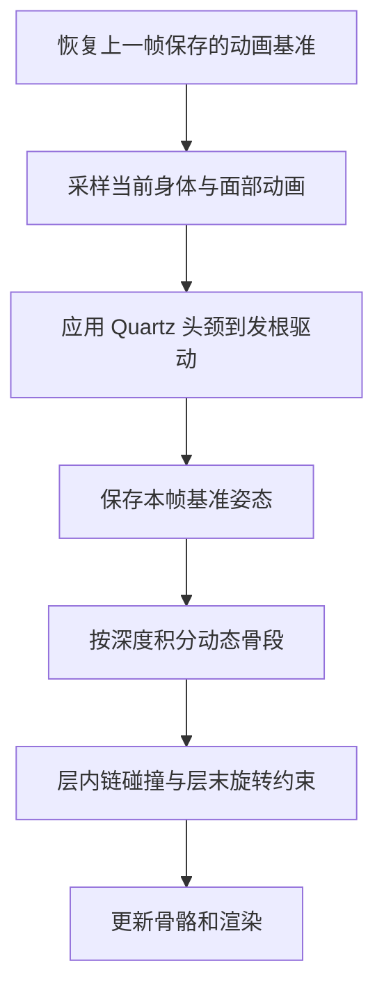

**基线：v37。目标：把原资产参数、已核对的原指令行为和实测碰撞顺序接入 Unity，形成可重复验证的播放器。**

本笔记讲实现组织与调试方法。原算法判断的来由见 [逆向笔记](/hski-hair/reverse-engineering/)。当前实现不是完整 ActorAnimation 库，覆盖重点是本次 HSKI 0070 头发所用路径。

## 1. 先划清数据、计算和展示的职责

| 层次 | 主要文件 | 负责什么 |
|---|---|---|
| 资产提取 | `inspect_swing_bundle.py`、原始导出 JSON | 保存字段、组件身份与来源 |
| 配置生成 | `build_hski_collision_config.py` | 合并头发链、身体/面部碰撞数据 |
| 实测排序 | `apply_registration_order.py` | 将固定游戏采集映射到资产，不改参数 |
| 运行时求解 | `ActorAnimationSwingSolver.cs` | 状态、Quartz、积分、碰撞、限角、链 |
| 场景兼容 | `HskiHairDynamics.cs` | 保留原场景引用，继承实际求解器 |
| 动画与显示 | `HskiShowcase.cs` | 采样姿态、调用发根驱动、展示动作 |
| 验证与录制 | `ActorSwingNativeChecks.cs`、`HskiAutoWindDemoRecorder.cs` | 构建检查与确定性录制 |
| 局部诊断 | `ActorSwingHandAudit.cs`、`audit_hand_frames.py` | 保存阶段输入并用原指令复算 |

这样分开以后，更换注册顺序只改输入；修改旋转公式只影响计算核；调整相机不会进入物理状态。诊断代码可以保存计算过程，而不需要给生产算法加额外修正。

代码入口：[求解器](/assets/hski-solver-notes/references/9e0b2ee3-ActorAnimationSwingSolver.cs.txt)、[构建器](/assets/hski-solver-notes/references/3d15f44a-HskiHairBuilder.cs.txt)、[配置生成器](/assets/hski-solver-notes/references/73b4668f-build_hski_collision_config.py.txt)。

## 2. 初始化：把配置变成可求解的骨段

初始化先读取原配置，再按名称寻找模型中的 Transform。103 个设置全部匹配，但没有有效子节点的末端标记不构成可旋转骨段，最终得到 75 段。

每段保存几类数据：

- **不随积分改变的绑定信息**：骨、子骨、局部轴、骨长、子局部位置/旋转、所属深度、父段链接。
- **本帧动画基准**：采样后的局部/根空间姿态，默认端点和默认旋转。
- **持续的模拟状态**：端点位置、积分位移 `speed`、当前 self 变换、预热缓存。
- **约束与诊断**：动态球半径、mask、限角设置、命中数和阶段残差。

这里容易漏掉的一点是“谁拥有骨段”与“积分读取谁的动态参数”不同：实现以父骨拥有链接，但优先使用子骨对应的动态设置，这是从原始调用的字段读取核对出来的。不能遍历到哪个组件，就把它的所有参数直接用于整条父子链接。

节点按层级深度组织，供后续逐层结算。当前名称匹配会取同名 Transform 中的第一个；该方案适用于已经核对过的模型，不应不经检查地推广到任意重名骨架。

## 3. 动画姿态与模拟姿态不能互相污染

本地展示流程为：



这一图描述当前本地接入方式，不是已完整证实的游戏调度图。原进程的同姿态输入与写回时机还需要端到端采集。

如果 Animator 在解算之后再次采样，模拟结果会被覆盖；如果下一帧把已模拟旋转当作动画输入，又会产生反馈。恢复、采样、发根驱动、保存基准这四步必须区分清楚。切动作时请求重置，先恢复状态再预热。

当前求解状态主要处于角色根空间。`rootCancel` 用于按整体和骨段权重处理 hips/root 的影响，碰撞调用前后会相应补回或扣除。记录日志时必须注明空间，否则世界坐标和根空间坐标的差值没有诊断意义。

## 4. Quartz 和发梢动态分开实现

Quartz 负责由头、颈运动驱动部分发根；发梢的 ActorSwing 求解负责后续摆动。二者同时存在，不能用一个弹簧同时承担全部联动，再把 Quartz 重复叠上去。

制作步骤是：保留原始 9 份设置 → 复制后执行单位和坐标转换 → 绑定实际头颈 → 用原版约定计算驱动位置/旋转 → 将结果作为后续动态的姿态输入。转换只做一次，防止重复初始化把 `.01` 再乘一遍。

对应入口：[NativeConvertQuartz](/assets/hski-solver-notes/references/9e0b2ee3-ActorAnimationSwingSolver.cs.txt)、[ApplyQuartzHairDrivers](/assets/hski-solver-notes/references/9e0b2ee3-ActorAnimationSwingSolver.cs.txt)。

## 5. 单段积分：按实际状态与执行顺序移植

下面是帮助理解的简化流程，省略了坐标、风和 Slide 分支，不能直接替代生产实现：

```text
remaining = 0.01667 × (预热时 count×0.5，否则 1)
while remaining > 0:
    step = float32(min(remaining, 0.01667) × 40)
    force = 原版 stiffness / pendulum 项
          + (默认子端点 - 当前子端点) × (1-damping)^2
          + 质量项
          + 非预热时的 spring 项
    speed = force × step × swingPowerWeight
    next = current + speed
    从未投影的 next 求 selfRotation
    投影回原骨长
    按静态列表依次碰撞，每次命中再投影骨长
    保存 current / next
    remaining -= 0.01667
    预热时检查五位置缓存是否稳定
```

这里 `speed` 是原算法保存的积分位移，不宜直接按“米/秒速度”理解或使用。预热会关闭 spring 和 Slide 耦合，不是简单执行 30 次完整人物更新。普通积分使用原常数时间预算，也不等于整个系统所有逻辑都忽略传入帧时长：风时间、展示采样等仍有各自时间输入。

逐层结算时，先积分本层，再处理本层链，随后求受限旋转、组合父 self 变换与子 local 变换，把状态交给下一层。全部积分完再统一修旋转，会改变下游输入。

对应入口：[Step](/assets/hski-solver-notes/references/9e0b2ee3-ActorAnimationSwingSolver.cs.txt)、[IntegrateNode](/assets/hski-solver-notes/references/9e0b2ee3-ActorAnimationSwingSolver.cs.txt)。

## 6. 碰撞：数据的排列也是算法输入

v37 使用基础面部 1 项与校服身体 18 项原始碰撞数据。动态骨 mask 与静态 mask 按位相与为 0 时跳过；相同骨骼可以有不同类型、不同 mask 的多个代理。

例如 RightHand 同时有 Line 和 Capsule：Line 表示与父骨有关的段，Capsule 表示手掌区域，不能当作重复数据删掉。

碰撞核的顺序是：检测 → 接触点 → 骨长投影 → 用更新后的中心继续检测下一项。投影算子通常不可交换，所以胸部先于手部与手部先于胸部会产生不同结果。检测阶段推出成功，也不能保证骨长约束或层末限角之后仍无重叠。

v37 的生成器会先验证资产参数与固定采集的参考一致，再匹配参数和句柄关系。已确认部分按游戏排列；仅小腿槽位 4/5 保留旧相对顺序。构建器再校验 19 项的名称、类型与 mask，防止后续导出无意恢复旧顺序。

这是输入复现，不是为了画面好看而手动交换两个碰撞体。原参数审计和内容多重集比较确认，碰撞体数值本身未变。

## 7. 链约束与数值一致性

本次 7 个活动头发链层的 `around=false`、`smoothing=0`。当前需要恢复链碰撞，但不应凭此宣称非零闭环平滑也已验证。代码保留的其他分支与本次已有证据覆盖范围必须分开。

浮点实现方面，v36 已将关键点积、叉积、四元数乘法和向量旋转按原指令顺序组织，并以 `F32` 固定中间单精度舍入。目的在于避免分支和数值偏移，不是通用性能优化；它有执行开销，也没有取代实测。

面对失败样本，先比较同一输入的中间量：轴方向 → dot → FromTo 分支 → 未约束 next → 投影结果。不要先改 stiffness、放宽误差阈值或加角度截断，否则会掩盖转写错误。

## 8. 把验证放进制作流程

### 构建前

- 检查资产参数与参考文件内容一致。
- 检查碰撞列表是完整排列，没有遗漏或重复。
- 运行 3548 组原指令对照；失败直接中止构建。

这 3548 组由 512 力项、512 胶囊转换、180 Quartz、512 Swing 旋转、512 动态碰撞、512 链碰撞、128 受控整段积分和 680 精确输入 FromTo 组成。128 组整段样本是受控单段、无风/静态碰撞/链的情形，不是完整角色的一切分支。

### 构建后

- 固定 30 fps 重录三个动作，正背面各 301 帧。
- 输出播放器真正读取的配置，核对它与构建输入相等。
- 检查有限值、骨段数量和各视角相同时间的状态一致性。
- 对具体问题帧保存输入和分阶段输出，再交给原指令复算。

手部审计记录“碰撞前、接触点、骨长投影后、层末后、渲染端点”，因此能分辨误差在哪里出现。不要只记录一个 `maxPenetration`，然后把它叫作最终画面穿模深度。

## 9. v37 制作后的实际结果

第一段动作第 24 帧，手部代理重叠在碰撞阶段从 19.872 mm 降至 12.689 mm，层末从 27.324 mm 降至 22.564 mm。第 15–38 帧窗口的平均层末重叠从 2.787 mm 升至 2.936 mm，说明峰值降低不代表整个动作全面改善。

48 条实际采样复算中，碰撞最大位置差约 0.093 微米、命中次数差异为 0；最终端点最大差约 0.552 微米。这验证了新输入下的计算，没有证明渲染网格无穿插。

当前 Builder 移除了旧的贴胸网格、手部 IK 压发、脸/下巴/袖子额外修正组件。历史兼容字段和类仍可能留在源码中，但“类存在”不等于本次场景启用了它。

## 10. 如何继续制作或复现

工程：GakumasSample2。工作区实现位于 [actor_animation_solver](/assets/hski-solver-notes/references/e308611a-README.md.txt)，修改后需同步相应运行时脚本和 `Editor` 脚本至项目的 `Assets/PortfolioPreview`。

```powershell
# 工作目录：E:/ArinLee/简历
# 重建并核对碰撞配置；会写入 HskiHair0070.json。
& 'C:/Users/Arin/.cache/codex-runtimes/codex-primary-runtime/dependencies/python/python.exe' work/build_hski_collision_config.py

# 源码和配置同步到 Unity 项目后，构建会先执行严格检查。
& 'D:/unity/2022.3.56f1c1/Editor/Unity.exe' -batchmode -quit -projectPath 'E:/ArinLee/gkmas/yuki_Render/UnityProject/GakumasSample2' -executeMethod HskiHairBuilder.Build -logFile 'E:/ArinLee/简历/work/actor_animation_solver/UnityBuild_v37.log'
```

录制使用 v37 播放器 的 `-autoWindDemo -handCollisionAudit` 参数；输出到独立 v37 目录。重新执行同版录制会重写该版记录，做新实验前先保留基线。

完整结果与证据：[v37 重放报告](/assets/hski-solver-notes/references/8edbea33-V37_REGISTRATION_REPLAY_20260915.md.txt)、[源码/录像哈希](/assets/hski-solver-notes/references/1f55310b-manifest.json)。

下一步优先取得原游戏同动画时刻的头颈姿态、根空间输入与动态骨轨迹。现有残差不宜通过加大半径或追加修正迭代“调没”，否则会再次偏离当前的原生复现目标。
